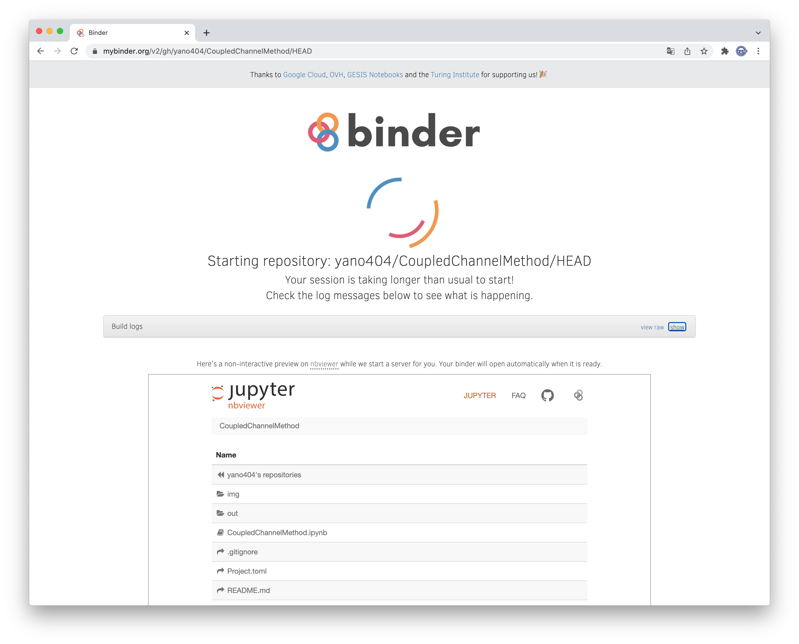
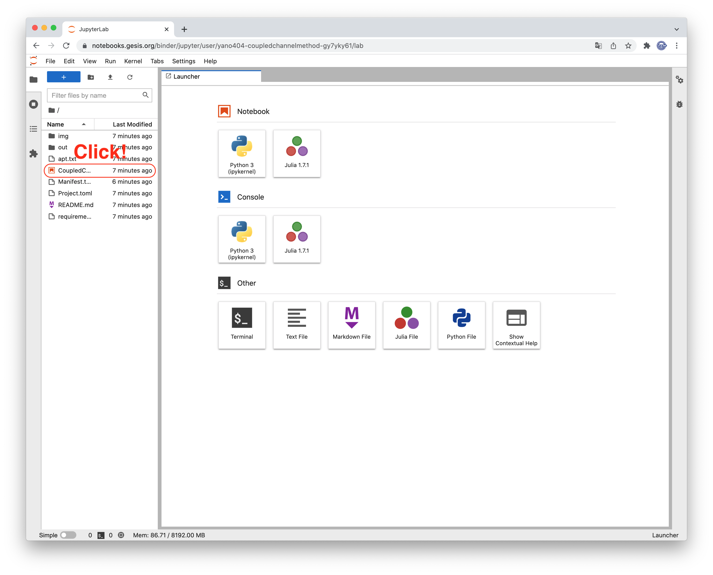
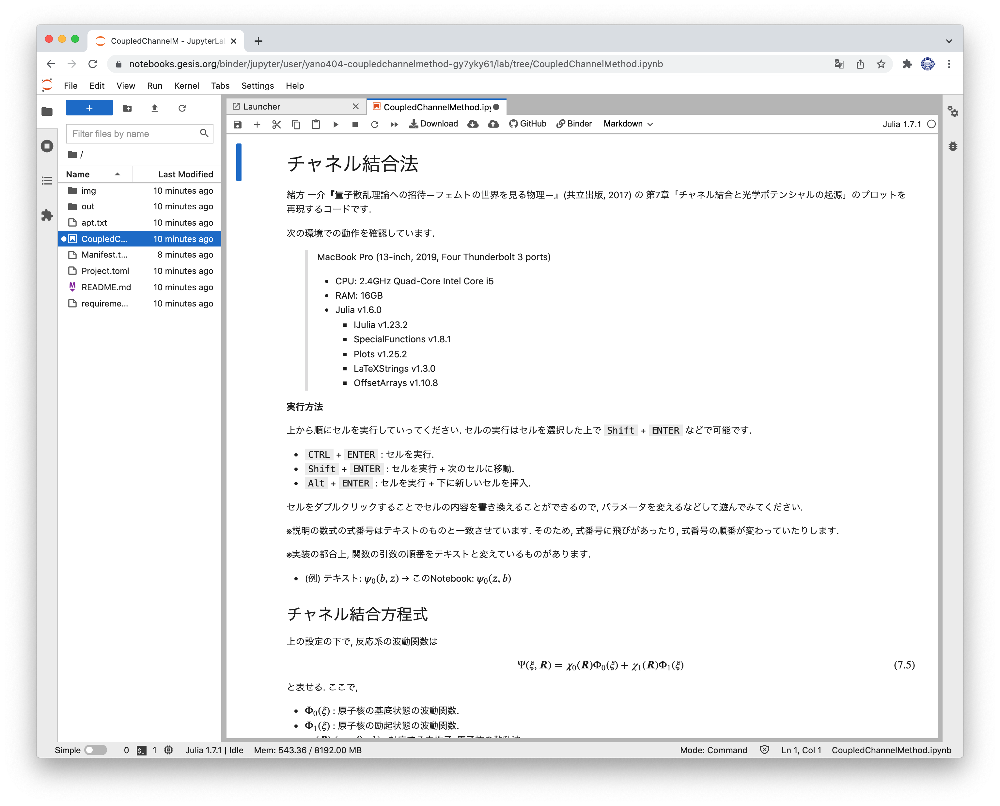

# Coupled Channel Method

[緒方 一介『量子散乱理論への招待―フェムトの世界を見る物理―』(共立出版, 2017)](https://www.kyoritsu-pub.co.jp/bookdetail/9784320036000) の 第7章「チャネル結合と光学ポテンシャルの起源」のプロットを再現するjupyter Notebookです.

binderで実行できます(環境構築は不要です).

## binder での実行方法

上の`launch binder` をクリックしてください.
binderにアクセスできます.

起動には5~10分程度かかります.
(Build済みのイメージがある場合はすぐに起動します.)

起動後, Jupyter Lab の画面が表示されるので, 左のファイル一覧から `CoupledChannelMethod.ipynb` をクリックして起動してください.

上から順番にコードセルを実行していってください.
`Shift` + `Enter` や `Ctrl` + `Enter` を押すことでコードセルは実行できます.

セルをダブルクリックすることでセルの内容を書き換えることができるので, パラメータを変えるなどして遊んでみてください.

